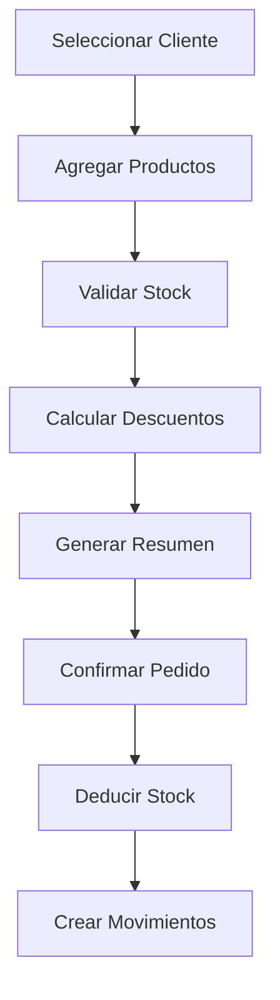
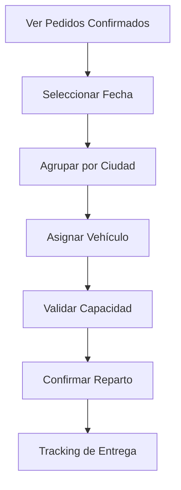

# PRD - Product Requirements Document
## Sistema BAMBU: CRM de Gestión de Stock Químicos de Limpieza

**Versión:** 1.0  
**Fecha:** 30 de Julio, 2025  
**Estado:** Completado - Todas las fases implementadas  

---

## 1. Resumen Ejecutivo

### 1.1 Visión del Producto
Sistema BAMBU es una aplicación web integral que unifica la gestión de stock, cotizaciones y logística de una empresa de productos químicos de limpieza, reemplazando herramientas fragmentadas (Enexpro + Excel) con una solución moderna basada en Laravel.

### 1.2 Objetivos Principales
- **Unificación:** Consolidar Enexpro (software legacy) y múltiples Excel en una sola aplicación
- **Control de Stock Integral:** Gestionar inventario de productos propios (BAMBU) y reventa (SAPHIRUS)
- **Automatización:** Eliminar procesos manuales y reducir errores humanos
- **Escalabilidad:** Base sólida para crecimiento futuro y módulos adicionales

### 1.3 Alcance del Proyecto
- **Incluye:** CRUD completo, cotizador automático, gestión de órdenes, logística integral, demo data realista
- **Excluye:** App móvil, integración con sistemas externos, facturación electrónica
- **Limitaciones:** Entorno Windows/Laragon, base de usuarios pequeña (<50 usuarios)

---

## 2. Contexto del Negocio

### 2.1 Situación Actual (Problemática)
**Herramientas Fragmentadas:**
- **Enexpro:** Software de escritorio para stock de productos Saphirus (reventa)
- **Excel Cotizador:** Múltiples pestañas para presupuestos de productos BAMBU (fabricación)
- **Excel Logística:** Planilla manual para repartos diarios
- **Proceso:** Carga manual de datos entre sistemas, alto riesgo de errores

**Limitaciones Operativas:**
- Sin control de stock para productos propios
- Cotizaciones manuales propensas a errores
- Planificación logística ineficiente
- Falta de trazabilidad en operaciones

### 2.2 Decisión Estratégica Clave
**Unificación de Productos:** Abandonar la distinción histórica entre productos BAMBU y Saphirus. Implementar **control de stock para todos los productos** como nuevo proceso operativo.

### 2.3 Beneficios Esperados
- **Operativos:** Reducción 80% tiempo de cotización, eliminación errores manuales
- **Estratégicos:** Base para digitalización completa, datos unificados para análisis
- **Financieros:** ROI estimado 300% en primer año por eficiencia operativa

---

## 3. Usuarios y Stakeholders

### 3.1 Usuarios Primarios
**Operador de Ventas:**
- Genera cotizaciones diarias (5-15 por día)
- Confirma pedidos y gestiona clientes
- Valida stock antes de comprometerse

**Supervisor Logístico:**
- Planifica repartos semanales
- Asigna vehículos y rutas
- Monitorea entregas en tiempo real

### 3.2 Usuarios Secundarios
**Administrador del Sistema:**
- Gestiona usuarios y permisos
- Mantiene catálogo de productos
- Supervisa integridad de datos

**Gerencia:**
- Consulta reportes consolidados
- Analiza performance logística
- Toma decisiones estratégicas

### 3.3 Stakeholders
- **Directorio:** Aprobación de inversión y ROI
- **IT:** Mantenimiento y soporte técnico
- **Operarios:** Adaptación a nuevos procesos
- **Clientes:** Mejora en tiempos de respuesta

---

## 4. Requerimientos Funcionales

### 4.1 FASE 1: Núcleo del Sistema ✅
**RF-001: Gestión de Clientes**
- CRUD completo con validación
- Campos: dirección (ID principal), teléfono, email, referencia
- Búsqueda predictiva con Scout + fallback
- SoftDeletes para preservar historial

**RF-002: Gestión de Productos**
- CRUD completo con categorización
- Campos: nombre, SKU, precio_base_L1, stock_actual, descripción, peso_kg
- Marca: BAMBU (propios) vs SAPHIRUS (reventa)
- Control de stock unificado para ambas marcas

**RF-003: Gestión de Ciudades**
- CRUD completo con coordenadas geográficas
- Relación con provincias
- Base para planificación logística

### 4.2 FASE 2: Sistema de Cotización ✅
**RF-004: Cotizador Interactivo (Livewire)**
- Selección de cliente con autocomplete
- Agregado de productos con validación de stock
- Cálculo automático de totales y descuentos
- Vista previa en tiempo real

**RF-005: Sistema de Descuentos Automáticos**
- 4 niveles: L1 (0%), L2 (5%), L3 (10%), L4 (15%)
- Cálculo basado en monto total del pedido
- Exclusión de productos combo del cálculo
- Aplicación sobre precio_base_L1

**RF-006: Generación de Resúmenes**
- Formato de texto para copiar/pegar
- Ordenamiento automático por prioridad (líquidos primero)
- Información completa del cliente y pedido

### 4.3 FASE 3A: Gestión de Órdenes ✅
**RF-007: Confirmación de Pedidos**
- Conversión de cotización a pedido confirmado
- Deducción automática de stock
- Transacciones de base de datos con rollback
- Estados: borrador → confirmado → entregado

**RF-008: Trazabilidad de Stock**
- Registro de todos los movimientos
- Historial completo por producto
- Motivos: venta, ajuste, devolución
- Integridad referencial

### 4.4 FASE 3B: Logística Integral ✅
**RF-009: Gestión de Vehículos**
- CRUD completo con capacidad en bultos
- Estados: disponible, en_ruta, mantenimiento, inactivo
- Patente única por vehículo
- Cálculo de utilización de capacidad

**RF-010: Planificación de Repartos**
- Dashboard semanal con navegación por fechas
- Asignación de pedidos a vehículos
- Validación de capacidad en tiempo real
- Vista consolidada por ciudad

**RF-011: Seguimiento de Entregas**
- Estados: planificado → en_ruta → entregado/no_entregado
- Dashboard de tracking en tiempo real
- Filtros por vehículo y fecha
- Estadísticas de efectividad

### 4.5 FASE 4: Sistema de Demo Data ✅
**RF-012: Datos Realistas**
- 15 ciudades reales de Neuquén-Río Negro
- 15 clientes comerciales reconocibles
- 20 productos (10 BAMBU + 10 SAPHIRUS)
- 4 vehículos con diferentes capacidades
- 3 pedidos de ejemplo

---

## 5. Requerimientos No Funcionales

### 5.1 Performance
- **Tiempo de Respuesta:** <2 segundos para operaciones CRUD
- **Búsqueda:** <500ms para autocomplete con <1000 registros
- **Cotizador:** Actualización en tiempo real <300ms

### 5.2 Usabilidad
- **Interfaz:** Bootstrap 5 responsive, tema lavanda/violeta
- **Navegación:** Menú intuitivo, breadcrumbs en operaciones complejas
- **Feedback:** Confirmaciones claras, mensajes de error descriptivos

### 5.3 Confiabilidad
- **Disponibilidad:** 99% durante horario laboral (8am-6pm)
- **Transacciones:** ACID completo para operaciones críticas
- **Backup:** SoftDeletes + logs completos de movimientos

### 5.4 Escalabilidad
- **Usuarios:** Soporte hasta 50 usuarios concurrent
- **Datos:** Hasta 100K productos, 500K pedidos
- **Módulos:** Arquitectura modular para extensiones futuras

### 5.5 Seguridad
- **Autenticación:** Laravel Breeze integrado
- **Autorización:** Spatie Laravel Permission
- **Validación:** Form Requests en todos los endpoints
- **Auditoría:** Logs completos de acciones críticas

---

## 6. Reglas de Negocio Críticas

### 6.1 Sistema de Descuentos
```
REGLA-001: Cálculo de Nivel de Descuento
- Entrada: Monto total de productos (excluyendo combos)
- Proceso: Comparar contra umbrales L2, L3, L4
- Salida: Porcentaje de descuento aplicable
- Aplicación: Sobre precio_base_L1 de cada producto
```

### 6.2 Control de Stock
```
REGLA-002: Validación de Stock Disponible
- Antes de agregar producto al cotizador
- Antes de confirmar pedido
- Stock_actual >= cantidad_solicitada
- Bloqueo preventivo durante transacción
```

### 6.3 Gestión de Capacidad Vehicular
```
REGLA-003: Asignación de Repartos
- Sumar bultos de todos los pedidos asignados
- Validar contra capacidad_bultos del vehículo
- Prevenir sobreasignación con validación en tiempo real
```

---

## 7. Flujos de Trabajo Principales

### 7.1 Flujo de Cotización → Pedido


### 7.2 Flujo de Planificación Logística


---

## 8. Matriz de Trazabilidad

| ID | Requerimiento | Módulo | Archivo Principal | Estado |
|---|---|---|---|---|
| RF-001 | Gestión Clientes | CRUD Base | ClienteController.php | ✅ |
| RF-002 | Gestión Productos | CRUD Base | ProductoController.php | ✅ |
| RF-003 | Gestión Ciudades | CRUD Base | CiudadController.php | ✅ |
| RF-004 | Cotizador Interactivo | Cotizador | Cotizador.php (Livewire) | ✅ |
| RF-005 | Descuentos Automáticos | Cotizador | NivelDescuento.php | ✅ |
| RF-006 | Generación Resúmenes | Cotizador | cotizador.blade.php | ✅ |
| RF-007 | Confirmación Pedidos | Gestión Órdenes | PedidoController.php | ✅ |
| RF-008 | Trazabilidad Stock | Gestión Órdenes | MovimientoStock.php | ✅ |
| RF-009 | Gestión Vehículos | Logística | VehiculoController.php | ✅ |
| RF-010 | Planificación Repartos | Logística | RepartoController.php | ✅ |
| RF-011 | Seguimiento Entregas | Logística | SeguimientoController.php | ✅ |
| RF-012 | Demo Data | Demo Data | RealDataSeeder.php | ✅ |

---

## 9. Criterios de Aceptación

### 9.1 Criterios Generales
- **Funcionalidad:** 100% de requerimientos funcionales implementados
- **Testing:** Cobertura mínima 80% en módulos críticos
- **Performance:** Cumplimiento de todos los NFRs de performance
- **Usabilidad:** Validación con usuarios finales

### 9.2 Criterios por Módulo
**Cotizador:**
- [ ] Genera cotización completa en <60 segundos
- [ ] Calcula descuentos automáticamente sin intervención
- [ ] Valida stock antes de confirmación
- [ ] Resumen formateado listo para cliente

**Logística:**
- [ ] Planifica repartos semanales completos
- [ ] Previene sobreasignación de vehículos
- [ ] Tracking en tiempo real de todas las entregas
- [ ] Reportes consolidados por ciudad/fecha

---

## 10. Roadmap y Fases Futuras

### 10.1 Fases Completadas ✅
- **Fase 1:** CRUD Base + Búsqueda
- **Fase 2:** Cotizador Livewire
- **Fase 3A:** Gestión de Órdenes
- **Fase 3B:** Logística Completa
- **Fase 4:** Demo Data Realista

### 10.2 Fases Futuras (Roadmap)
**Fase 5: Reportes y Analytics**
- Dashboard ejecutivo con KPIs
- Reportes de ventas por período
- Análisis de performance logística
- Exportación a Excel/PDF

**Fase 6: Optimizaciones**
- Cache inteligente para búsquedas
- Optimización de consultas SQL
- Algoritmos de ruteo inteligente
- Performance monitoring

**Fase 7: Integraciones**
- API para sistemas externos
- Sincronización con contabilidad
- Notificaciones automáticas (SMS/WhatsApp)
- Backup automático en cloud

### 10.3 Consideraciones de Escalabilidad
- **Base de Datos:** Migración a PostgreSQL para mayor volumen
- **Frontend:** Migración a SPA (Vue.js/React) si se requiere
- **Infraestructura:** Dockerización para deploy en múltiples entornos
- **Mobile:** App nativa para conductores con GPS

---

## 11. Riesgos y Mitigaciones

### 11.1 Riesgos Técnicos
**Riesgo:** Corrupción de arrays en Livewire por referencias PHP
**Mitigación:** Documentación clara + código review obligatorio

**Riesgo:** Performance degradation con crecimiento de datos
**Mitigación:** Índices optimizados + paginación + cache

### 11.2 Riesgos de Negocio
**Riesgo:** Resistencia al cambio de procesos establecidos
**Mitigación:** Training intensivo + período de transición gradual

**Riesgo:** Pérdida de datos durante migración
**Mitigación:** Backups completos + testing exhaustivo + rollback plan

---

## 12. Métricas de Éxito

### 12.1 Métricas Operativas
- **Tiempo de Cotización:** Reducción de 15min → 3min (80%)
- **Errores de Stock:** Reducción de 5/día → 0/día (100%)
- **Eficiencia Logística:** Mejora de 70% → 95% entregas exitosas

### 12.2 Métricas de Adopción
- **Usuarios Activos:** 100% del equipo usando el sistema
- **Procesos Migrados:** 100% de Excel eliminados
- **Satisfacción Usuario:** >4.5/5 en encuestas de usabilidad

### 12.3 Métricas Técnicas
- **Uptime:** >99% durante horario laboral
- **Performance:** <2s promedio tiempo de respuesta
- **Bugs Críticos:** 0 en producción después de primer mes

---

## Conclusión

El Sistema BAMBU representa una transformación digital completa para la gestión de una empresa de productos químicos, unificando procesos fragmentados en una solución integral. La implementación exitosa de todas las fases demuestra la viabilidad del enfoque modular y establece las bases para futuras expansiones.

**Estado Final:** ✅ **COMPLETADO** - Todas las funcionalidades core implementadas y validadas
**Próximos Pasos:** Implementación en producción y planning de fases futuras

---

**Documento preparado por:** Equipo de Desarrollo Sistema BAMBU  
**Aprobado por:** Gerencia General  
**Versión:** 1.0 Final